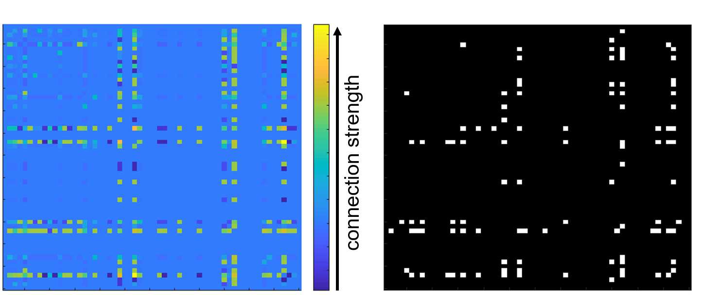

For help, questions, corrections or feedback please contact: *awed2@cam.ac.uk*

# Analysing the effects of genotype on cortical network development using graph theory
Scripts are from my PhD work in the Neuronal Oscillations groups (Dept. of PDN, University of Cambridge) carried out under the supervision of Dr Susanna Mierau and Prof Stephen Eglen. Where other authors wrote or contributed to scripts, this is indicated at the top of the script.

**Poster presented at Cambridge Neuroscience conference (#ABC2019), September 2019** [click here](https://drive.google.com/file/d/1S1rNTnI17tioU4a_Gbh8fdOPPjm9pTQS/view?usp=sharing)

**Poster presented at Federation European Neuroscience Societies (FENS) 2020 conference, July 2020** [click here](https://drive.google.com/file/d/1g455YSxA0gChoNSN2Uxrzi7-HaYh-XPg/view?usp=sharing)

## Scripts found in this repository were ultimately used for: 
(1) applying graph theory to cortical neurons cultured on microelectrode arrays; (2) comparing wild-type and Mecp2-deficient networks.

## Summary
These scripts take .mat files containing multielectrode array extracellular recordings an create spike matrices for each recording. That is, a sparse matrix is created where there is a binary vector for each channel indicating spike times (referred to as *spike trains*). Various analyses can be performed on spiking activity and one can also plot spikes and voltage traces in various ways. Bursting activity can then be detected using these spike matrices. This produces a cell variable which tells the user the burst start and end times as well as the electrodes containing spikes that contributed to the burst. Currently, functional connectivity is calculated by correlating spiking activity.

Currently, functional connectivity is calculated across entire spike trains rather than within bursts. This will be added in a future update.

*Figure 1: Overview of analyses. Filtered traces in each electrode (A: from Figure 2.2) are used to detect spikes (B: heatmap of spike counts in each electrode). User creates adjacency matrices (C) for functional connectivity by correlating spike trains between pairs of electrodes. I created network graphs (D: Figure 3.20) based on this functional connectivity. Bursts (E: from Figure 3.7) were also detected based on spiking activity. Red solid boxes indicate graphs in 8x8 array layout where each square or trace represents an electrode.*

## Steps

### 1. Record MEA activitiy using MC Rack software to produce .mcd files. 
Convert these to .raw files using the MC Data tool (available online). Then use MEAbatchConvert.m to convert the .raw files to .mat files. See the "mecp2" repository to get detailed instructions. The .mat files will contain a variable called "dat" — this contains a matrix with a row for each electrode and a column for each sample. Thus, if there are 60 electrodes in the array, there will be 60 row vectors containing voltage traces. There is also a vatiable called "channels" that tells the user which electrode each row corresponds to in terms of the electrode ID (e.g. electrode 78 is column eight, row 7 in the MEA). For example, if row 10 of *channels* is "78" then row 10 of *dat* is the voltage trace for the electrode in column 8, row 7 of the MEA.

### 2. Detect spikes using the .mat files. 
This creates spike matrices.

*Figure 2: Illustration of spike detection with example spikes. A: spikes detected using the template; template shown in blue box. B: spike detected using the threshold method; threshold indicated by blue dashed line. Spikes are overlaid with the negative peaks aligned at 1 ms (red, bold lines are the average waveforms). These are the first 50 spikes detected from the same electrode.* 

### 3. Carry out spiking and bursting analyses on spike matrices.

### 4. Create weighted adjacency matrices by correlating spike trains within spike matrices of each recording. 
There are multiple options for correlation including cross-correlations, cross-covariance and spike time tiling coefficient. Refer to Cutts and Eglen (2014) for a comparison of methods and Schroeter et al. (2015) for an example of the use of cross-covariance in MEAs.

*Figure 3: Conversion of weighted connections to a binary matrix. A: adjacency matrix showing the connection (edge weight) between electrode pairs. Scalebar in terms of spike time tiling coefficient. B: white squares indicate where supra-threshold connections (STTC>0.5) converted to binary edges.*

### 5. Carry out functional connectivity and graph analyses.

*Figure 4: Example of an MEA network graph over development. Scale bar represents spike time tiling coefficient. Orange circles represent nodes, with the size of the circle proportional to node degree. Nodes that were part of the rich club are circled in black.*

**Steps 3–5 are done using network_features_MEA.m**

Currently, the script works on spike matrices with 60 channels. To exclude electrodes, set the spike train of that electrode to that of the reference electrode.

The network feature vector for each recording can be manually copied into excel. Desired feature can then be saved as a csv file and analysed with the R analysis script.

Future developments include further options for customisation; machine learning applied to the feature vector.
